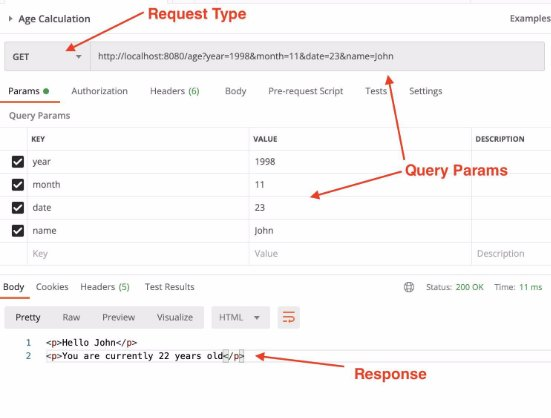
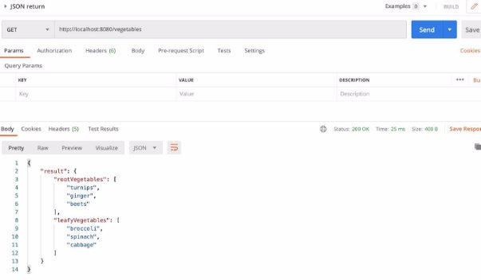
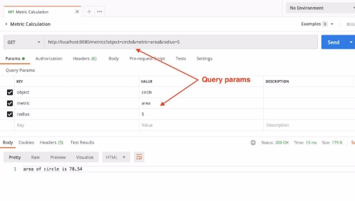
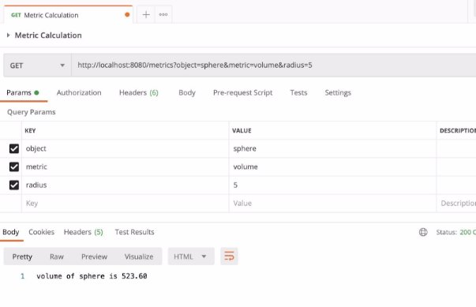

# Node Js assignment Board infinity

**Problem 1:** 

Build an API to calculate current age of user from date of birth  

Request URL:-  [*http://localhost:8080/age?year=1998&month=11&date=23&name=John](http://localhost:8080/age?year=1998&month=11&date=23&name=John)* Request Method:- GET 

Response HTML:- 

*
Hello John
 *

*
You are currently 22 years old
* 

**Objective:-** 

Build an API with the above parameters using Node.js.* 

**Learnings:** 

How to make an http-server and endpoints using core Node.js modules.

**Problem 2:** 

Return a JSON response by reading a local file using Node.js 

Request URL:-  [*http://localhost:8080/vegetables](http://localhost:8080/vegetables)* Request Method:- GET 

Response JSON:- 

*{ *

`   `*"result": {* 

`       `*"rootVegetables": [            "turnips",* 

`           `*"ginger",* 

`           `*"beets"* 

`       `*],* 

`       `*"leafyVegetables": [            "broccoli",* 

`           `*"spinach",* 

`           `*"cabbage"* 

`       `*]* 

`   `*}* 

*}* 

**Objective:-** 

1. Create a file with `.json` extension in your project folder with below data:- 

{ 

`    `"result": { 

`        `"rootVegetables": [             "turnips", 

`            `"ginger", 

`            `"beets" 

`        `], 

`        `"leafyVegetables": [             "broccoli", 

`            `"spinach", 

`            `"cabbage" 

`        `] 

`    `} 

} 

2. Next read that JSON file in your server route using Node.js file system module. More details can be found here:- <https://www.w3schools.com/nodejs/nodejs_filesystem.asp> 
2. Return the data read from the JSON file in your route’s response. 

**Learnings** 

How to use Node.js file system module 

**Problem 3:** 

Build a area and volume calculation API for various objects based on query params sent with the request 

API URL:- <http://localhost:8080/metrics> 

Query params types possible:-  object: circle, sphere 

metric: 1. area(For circle)  

\2. volume or surfaceArea(For Sphere) 

radius: Integer value 

**Objective:-** 

Build an API which can calculate area of a circle or volume/surface area of a sphere based on inputs sent via query params. 

For example:- 

If the URL is `<http://localhost:8080/metrics?object=sphere&metric=volume&radius=5>` 

Then you need to calculate volume of a sphere with radius 5 units as shown below:- 

Refer to the query params section stated in the problem to understand other possible combinations.** 

**Learnings** 

How to use functions with request routes in Node.js

### `node server`

Runs the server in the development mode.\
Open [http://localhost:8080](http://localhost:8080) to view it in your browser.

